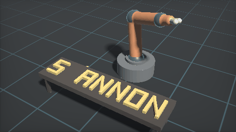
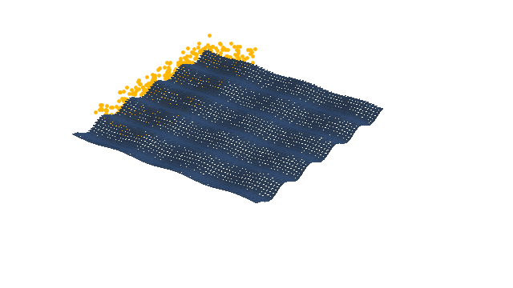
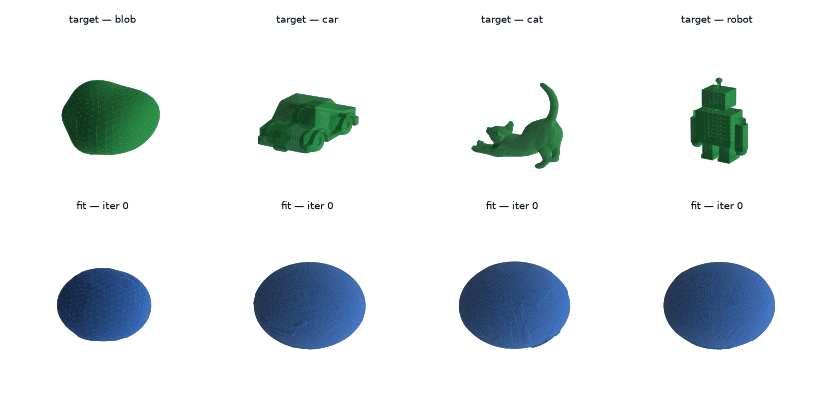
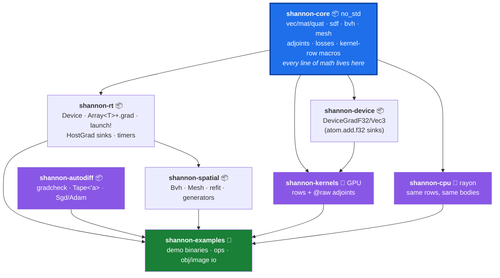

# shannon-autograd

> **Status: experimental.** This is a research prototype — APIs, measured numbers,
> and documentation may change without notice, and it has not been hardened for
> production use. [LIMITATIONS.md](docs/LIMITATIONS.md) is the honest ledger of
> what it does not do.

A differentiable GPU computing SDK in Rust. Kernels are ordinary Rust functions,
compiled ahead-of-time to PTX (via [cuda-oxide](https://github.com/NVlabs/cuda-oxide)'s
rustc codegen backend) **and** to a rayon CPU backend from the *same source*, with
reverse-mode autodiff over a tape of launches — including gradients through spatial
queries (BVH closest-point) via the envelope theorem.

|  |  |
|:--:|:--:|
| `arm_pick_place` — real-time SDF robot arm | `conveyor_sort` — grooved belt sorts particles |



*`shape_fit` — gradient descent through GPU kernels: one sphere shrink-wraps onto
four targets (blob, car, cat, robot); green is the target, blue is the optimized mesh.
More demo media in [docs/](docs/).*

Every number below was measured on the hardware in [RESULTS.md](docs/RESULTS.md)'s
environment table and is cited by section.

## The three claims

| # | Claim | Evidence | Reproduce |
|---|---|---|---|
| 1 | **Launch overhead is µs-scale native dispatch.** A launch is a typed function call — no interpreter, no per-argument marshalling. GPU launches measured **1.1–3.0× faster than Warp in 11 of 12 cells** (e.g. 17.87 vs 45.3 µs, `k0` direct); CPU dispatch is a direct call (**1.3–23 ns**) vs Warp's interpreted path (6.5–19 µs). | [RESULTS.md, launch overhead](docs/RESULTS.md#launch-overhead-20-000-launchescell-dim--1-median-of-3) | `cargo oxide run --bin launch_bench` |
| 2 | **One kernel source, two backends.** The same `shannon-core` body runs on GPU and under rayon, and they agree: ray-march parity 99.88 % of pixels < 1e-4; every spatial benchmark validates GPU == CPU == brute force *before* timing; mesh closest-point at **parity with Warp at 128 queries** (1.234 vs 1.301 ms), 1.45× behind at 16 384. | [RESULTS.md, mesh closest-point](docs/RESULTS.md#mesh-closest-point-queries-icosphere-subdiv-5-20-480-tris--10-242-verts) + prior-measurements table | `cargo oxide run --bin raymarch`<br>`cargo oxide run --bin mesh_bench` |
| 3 | **It is differentiable — through spatial queries.** Gradients flow backward through a tape of launches; the Chamfer demo optimizes through BVH closest-point queries. Stage 1 (SGD oracle): **8.9 orders** of loss decrease, matching the (1−lr)² theorem. Stage 2 (Chamfer + Adam): **3.5 orders**, GPU gradients matching the CPU backend at rel 1e-3. Car/cat/robot OBJ showcases: 2.5–3.6 orders. Full acceptance run: **1.08 s** wall. | [RESULTS.md, shape fitting](docs/RESULTS.md#differentiable-shape-fitting-shape_fit-acceptance-run) | `cargo oxide run --bin shape_fit` |

One architectural note on claim 3: the kernels being differentiated are *imperative* —
the Chamfer forward pass contains a BVH descent with a traversal stack and early exit.
Systems built on whole-array primitives cannot express that kernel shape directly; a
tape-of-launches design differentiates it as-is. This is a
difference in what the `grad` operator accepts, not a performance claim — no JAX
benchmark exists in this repository.

## Quickstart

Prerequisites: an NVIDIA GPU + CUDA Toolkit 12+, the
[cuda-oxide](https://github.com/NVlabs/cuda-oxide) checkout as a **sibling
directory** of this workspace (`Cargo.toml` uses path dependencies), and
`cargo-oxide` installed from it (`cargo install --path ../cuda-oxide/crates/cargo-oxide`).
`rust-toolchain.toml` pins the nightly toolchain; rustup fetches it on first build.

```bash
export PATH="$HOME/.cargo/bin:/usr/local/cuda/bin:/usr/lib/wsl/lib:$PATH"
cargo oxide doctor                 # validates driver / toolkit / toolchain — run once
cargo oxide run --bin affine    # ends with "✅ AFFINE ACCEPTANCE PASSED"
```

> ⚠️ **Avoid bare `cargo oxide build`.** It compiles PTX for a fixed default
> architecture; if that doesn't match your GPU, the first launch fails with CUDA
> error 218 ("a PTX JIT compilation failed"). Always `cargo oxide run` (auto-detects
> your GPU's arch) or pass `--arch <your arch>` explicitly. The auto-detection needs
> `nvidia-smi` on `PATH` — **if it isn't found, `cargo oxide run` silently falls back
> to the same default and you get the same error 218**. That is why the export above
> includes `/usr/lib/wsl/lib` (where WSL2 puts `nvidia-smi`; the entry is harmless on
> non-WSL machines). Run the export in every fresh shell.

## Everything you can run

| Binary | What it shows | Useful flags |
|---|---|---|
| `affine` | The vertical slice: one affine kernel forward + adjoint, gradient-checked, on both backends | — |
| `raymarch` | 2048×1024 SDF ray march, CPU/GPU parity check, PPM output | — |
| `shannon_anim` | Real-time animated robot-arm scene (live window) | `--frames N` (headless), `--still <t> <name>`, `--width/--height` |
| `arm_pick_place` | Real-time ARM-7 pick & place: a 4-DOF arm + gripper restores the sign's H, waves, bumps it back off (live window) | `--frames N` (headless), `--still <t> <name>`, `--parity`, `--width/--height` |
| `mesh_sim` | 1000 particles colliding with a deforming mesh — zero tunnelling over 200 frames | OBJ frame dumps built in |
| `conveyor_sort` | Original mesh-sim showcase: a grooved, running conveyor belt conveys particles and sorts them into lanes — delivery + sorting predicates | `--frames`, `--particles`, `--dump-every`, `--out-dir` |
| `mesh_bench` | Mesh closest-point benchmark, three-way validated | `--dump-obj`, `--unchecked-indexing` |
| `shape_fit` | Differentiable shape fitting: SGD oracle + Chamfer/Adam | `--target blob\|torus`, `--target-obj <path>`, `--subdiv`, `--iters`, `--smooth <λ>`, `--dump-every`, `--out-dir`, `--no-normalize` |
| `launch_bench` | Launch-overhead table (the claim-1 numbers) | — |
| `bvh_bench` | BVH AABB + ray query benchmark, three-way validated | `--unchecked-indexing` |

## Architecture



Three rules hold everywhere (they are why the parity results in claim 2 exist):

- **Every line of math lives in `shannon-core`** — a `no_std` crate with zero CUDA
  dependencies. `shannon-kernels` (GPU) and `shannon-cpu` (rayon) are thin adapters
  that call the same bodies; neither may contain arithmetic.
- **The output-type rule**: forward kernels write through `DisjointSlice` (each thread
  owns its index — race-free by construction); adjoint kernels read `&[T]` and
  accumulate through a `GradSink` (atomics), never `&mut`.
- **Kernels are declared once** in a shared row list; `shannon_gpu_kernels!` /
  the CPU mirror expand the same row into both backends.

## Differentiability in 20 lines

The real stage-1 loop from `shape_fit` (trimmed;
[`shannon-examples/src/bin/shape_fit.rs`](shannon-examples/src/bin/shape_fit.rs),
`part1_l2_sgd`):

```rust
let mut params = Array::from_slice(&host_params)?;   // vertices, on the GPU
let target    = Array::from_slice(&target_verts)?;
let mut loss  = Array::<f32>::zeros(1)?;
params.requires_grad_(true)?;
loss.requires_grad_(true)?;
let sgd = Sgd { lr: 0.05 };

for _ in 0..200 {
    // MUTATE — upload params, zero grads, seed ∂loss/∂loss = 1 (all before recording)
    params.copy_from_slice(&host_params)?;
    ops::begin_iteration(&mut [&mut params], &mut [], &mut loss)?;

    // TAPE — record forward launches; each record holds shared borrows of its buffers
    let mut tape = Tape::new();
    ops::l2_loss_op(&mut tape, &params, &target, &loss)?;
    tape.backward()?;   // replays adjoints in reverse, consumes the tape, releases borrows

    // STEP — host optimizer over the downloaded gradient
    let g = params.grad().unwrap().to_vec()?;
    sgd.step(vec3s_as_f32s_mut(&mut host_params), vec3s_as_f32s(&g));
}
```

The tape holds *borrows*, not reference counts: while any launch is recorded, the
borrow checker statically forbids `&mut` access to taped buffers, and `backward(self)`
consuming the tape is what makes the optimizer's mutation legal again. Stage 2 swaps
`l2_loss_op` for the symmetric-Chamfer ops — the closest-point correspondence is
requeried *untaped* each iteration and the gradient is exact under held correspondence
(envelope theorem).

## Custom targets

Any OBJ mesh can be a fit target. The loader auto-normalizes it (AABB center → origin,
max half-extent → 1.0) so it lands in the source sphere's query range; pass
`--no-normalize` for pre-scaled meshes.

```bash
# the car / cat / robot columns of the fitting GIF above (swap the target path)
cargo oxide run --bin shape_fit -- --target-obj assets/car.obj \
  --subdiv 5 --iters 400 --smooth 0.2 --dump-every 10 --out-dir fit_frames_car
```

That recipe produced the car, cat, and robot columns of the fitting GIF above
(2.5–3.6 orders of loss decrease each; exact numbers in
[RESULTS.md, shape fitting](docs/RESULTS.md#differentiable-shape-fitting-shape_fit-acceptance-run));
cross-backend gradient checks green on every run. Concavities drape rather than fold
in — correct Chamfer behavior from a genus-0 source — and on non-convex targets
(wheel wells, a cat's arched back, a robot's limb gaps) `--smooth <λ>` adds a
per-iteration Laplacian shrink-wrap step that stops large faces from tenting across
the gaps (see [LIMITATIONS.md](docs/LIMITATIONS.md) #11).

## Testing

Workspace-wide `cargo test` cannot link the example binaries (the PTX bundle symbol
exists only under cargo-oxide — [LIMITATIONS.md](docs/LIMITATIONS.md) #12), so the
canonical commands are:

```bash
export PATH="$HOME/.cargo/bin:/usr/local/cuda/bin:/usr/lib/wsl/lib:$PATH"
# host tests
cargo test -p shannon-core -p shannon-rt -p shannon-autodiff -p shannon-spatial -p shannon-cpu
cargo test -p shannon-examples --lib
# lint
cargo clippy --workspace --all-targets     # zero warnings
# the ten binaries, each to its pass banner
cargo oxide run --bin affine
cargo oxide run --bin raymarch
cargo oxide run --bin shannon_anim -- --frames 90
cargo oxide run --bin arm_pick_place -- --frames 90
cargo oxide run --bin arm_pick_place -- --parity
cargo oxide run --bin mesh_sim
cargo oxide run --bin conveyor_sort
cargo oxide run --bin mesh_bench
cargo oxide run --bin shape_fit
cargo oxide run --bin launch_bench
cargo oxide run --bin bvh_bench
```

## Documents

| Document | What it holds |
|---|---|
| [RESULTS.md](docs/RESULTS.md) | Every measured number, with environment and methodology — the single source of truth this README cites |
| [LIMITATIONS.md](docs/LIMITATIONS.md) | The honest ledger: 13 known limitations, each with symptom, workaround, and planned fix |
| [BACKLOG.md](docs/BACKLOG.md) | Planned work, ranked, each with pointers to its groundwork |
| [NOTICE](NOTICE) / [LICENSE](LICENSE) | Apache-2.0; attribution to cuda-oxide and NVIDIA Warp |
| [Design documents](docs/) | The build specifications the SDK was implemented from, with recorded deviations, plus all showcase media |

## License & attribution

Apache-2.0 ([LICENSE](LICENSE)). shannon-autograd is an original Rust SDK built on
[cuda-oxide](https://github.com/NVlabs/cuda-oxide); [NVIDIA Warp](https://github.com/NVIDIA/warp)
is prior art and the benchmark baseline, and three files port specific Warp algorithms
(see [NOTICE](NOTICE) and the per-file derivation headers). Not affiliated with,
endorsed by, or a product of NVIDIA.
